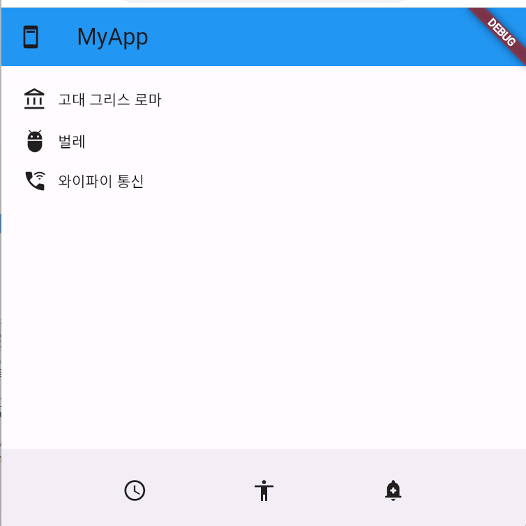

# flutter_basic_ui 프로젝트

https://www.youtube.com/playlist?list=PLfLgtT94nNq1izG4R2WDN517iPX4WXH3C  
간단한 강의듣고 코딩하며 공부한 프로젝트  
학습 내용마다 코딩하며 commit을 박아 공부  
commit과정을 보면 소스와 해당 내용을 볼수 있음

# book_list프로젝트

# shopping_mall프로젝트

